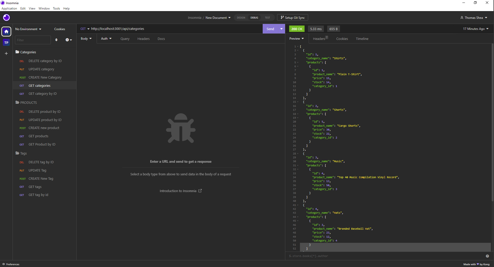
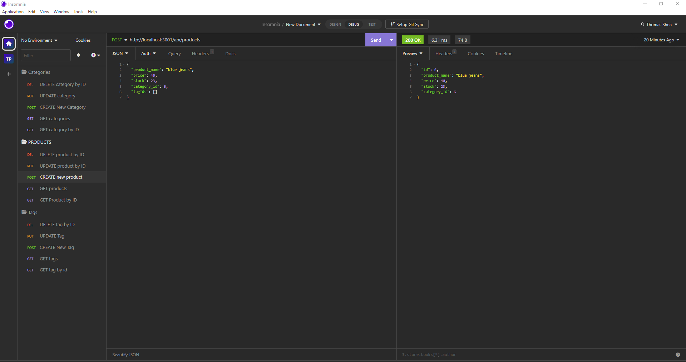
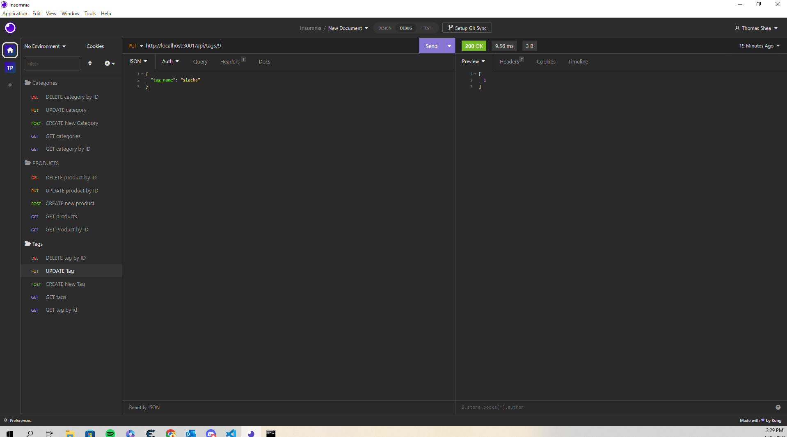

# E-Commerce Back End

## Description

This project is a back-end application for an e-commerce business. The purpose of designing this application is to allow a business owner or manager to be able to easily view inventory in stock, categories that each item belongs to, as well as tags that offer a description of the item. 

## Installation

In order to install this application, you will need to navigate to my [Github Repository](https://github.com/thomasjshea/E-Commerce-Back-End/) and clone the repository to your personal machine. You will need to be sure that you have MYSQL installed on your machine as well. 

## Usage

To use this application, you will need to navigate to the location where you cloned the repository using your command line. First, you will need to install the dependencies from the package.json file by running the command "npm i". You will need to copy the contents of the file '.env.example' into a .env file and input your MYSQL credentials. The database name is provided for you. After that, you will need to use the command "npm run seed" to seed your database with the intial data. Finally, you will use the command "npm start" to connect to your MYSQL database. You will use Insomnia to test your routes. 

Repository URL:

[https://github.com/thomasjshea/E-Commerce-Back-End/](https://github.com/thomasjshea/E-Commerce-Back-End/)

Screenshots:

## Credits

I completed this assignment on my own with no help. 

## License

This application uses the MIT License.
